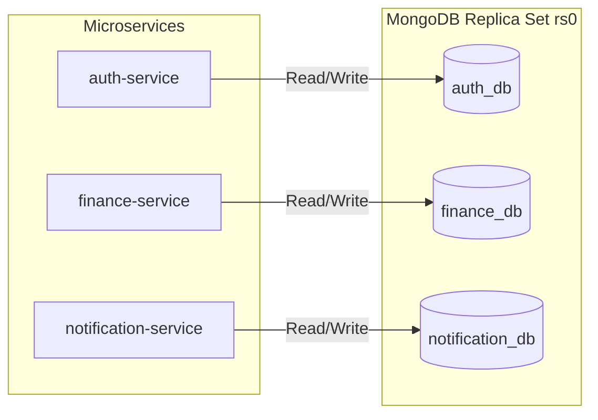
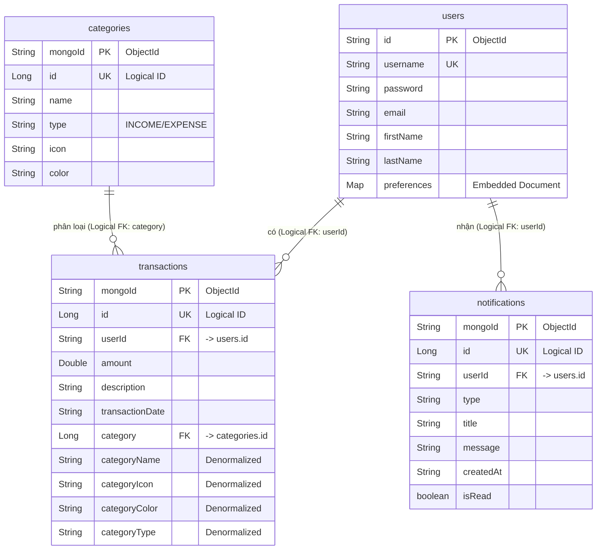

# TÀI LIỆU THIẾT KẾ CƠ SỞ DỮ LIỆU (DATABASE DESIGN)

## 1. TỔNG QUAN KIẾN TRÚC DỮ LIỆU

Hệ thống **Vibe Engineering** sử dụng cơ sở dữ liệu **MongoDB** chạy dưới dạng **Replica Set** (`rs0`) để đảm bảo tính sẵn sàng cao (High Availability) và dự phòng lỗi (Failover).

Tuân thủ kiến trúc Microservices, hệ thống áp dụng pattern **Database-per-service** (Mỗi dịch vụ sở hữu cơ sở dữ liệu riêng), giúp các dịch vụ độc lập hoàn toàn về mặt dữ liệu. Không có sự truy cập chéo trực tiếp (Cross-database joins) giữa các dịch vụ.



---

## 2. CHI TIẾT LƯỢC ĐỒ (SCHEMA & RELATIONSHIPS)

Dựa trên cấu trúc `@Document` thực tế của mã nguồn Java Spring Boot, dưới đây là đặc tả chi tiết cho từng cơ sở dữ liệu.

*Lưu ý: Vì MongoDB là NoSQL, khái niệm Khóa chính (Primary Key - PK) và Khóa ngoại (Foreign Key - FK) được hiểu ở mức ứng dụng (Logical), không phải mức ràng buộc vật lý (Physical Constraint) như SQL.*

### Sơ đồ Thực thể Liên kết (Logical ERD)
Dưới đây là sơ đồ mô tả mối quan hệ luận lý (Logical Relationships) xuyên suốt 3 cơ sở dữ liệu độc lập của hệ thống:



### 2.1. Phân hệ Xác thực (auth_db)

**Collection: `users`**
Lưu trữ thông tin hồ sơ và cấu hình cá nhân của người dùng.

| Thuộc tính (Field) | Kiểu dữ liệu | Ý nghĩa | Ràng buộc |
| :--- | :--- | :--- | :--- |
| `id` | `String` | Khóa chính (PK - ObjectId) | `@Id`, Unique |
| `username` | `String` | Tên đăng nhập | Unique |
| `password` | `String` | Mật khẩu (Hash) | Not Null |
| `email` | `String` | Địa chỉ email | |
| `firstName` | `String` | Tên | |
| `lastName` | `String` | Họ | |
| `preferences` | `Map<String, Object>` | Tùy chọn giao diện (Theme, Color) | Dạng Embedded JSON |

*Cấu trúc JSON minh họa:*
```json
{
  "_id": "64abc123...",
  "username": "nguyenvana",
  "password": "$2a$10$eImiTXuW...",
  "email": "vana@example.com",
  "firstName": "A",
  "lastName": "Nguyen Văn",
  "preferences": {
    "theme": "dark",
    "primary_color": "#FF5733"
  }
}
```

---

### 2.2. Phân hệ Tài chính (finance_db)

Đây là Core DB, xử lý giao dịch. Hệ thống sử dụng 2 loại ID: `mongoId` (String, tự sinh bởi MongoDB) và `id` (Long, ID tăng tự động dùng để giao tiếp qua API cho thân thiện).

**Collection: `categories`**
Danh mục thu/chi.

| Thuộc tính | Kiểu dữ liệu | Ý nghĩa | Ràng buộc |
| :--- | :--- | :--- | :--- |
| `mongoId` | `String` | Khóa chính vật lý (ObjectId) | `@Id` |
| `id` | `Long` | Khóa chính logic (Auto-increment) | |
| `name` | `String` | Tên danh mục (VD: Ăn uống) | |
| `type` | `String` | Loại (INCOME / EXPENSE) | |
| `icon` | `String` | Icon (font-awesome class) | |
| `color` | `String` | Mã màu Hex (#FF0000) | |

**Collection: `transactions`**
Lưu trữ giao dịch. Áp dụng **Denormalization (Phi chuẩn hóa)** bằng cách nhúng các thuộc tính của `Category` (`categoryName`, `categoryIcon`, `categoryColor`, `categoryType`) thẳng vào đây để tránh `$lookup` khi Get danh sách.

| Thuộc tính | Kiểu dữ liệu | Ý nghĩa | Ràng buộc |
| :--- | :--- | :--- | :--- |
| `mongoId` | `String` | Khóa chính vật lý (ObjectId) | `@Id` |
| `id` | `Long` | Khóa chính logic (Auto-increment) | |
| `userId` | `String` | **Khóa ngoại (FK)** trỏ tới `id` trong `users` (auth_db) | |
| `amount` | `Double` | Số tiền giao dịch | |
| `description` | `String` | Ghi chú giao dịch | |
| `transactionDate`| `String` | Ngày thực hiện giao dịch | |
| `category` | `Long` | **Khóa ngoại (FK)** trỏ tới `id` trong `categories` | |
| `categoryName` | `String` | Tên danh mục (Denormalized) | Dữ liệu nhúng |
| `categoryIcon` | `String` | Icon danh mục (Denormalized) | Dữ liệu nhúng |
| `categoryColor` | `String` | Màu danh mục (Denormalized) | Dữ liệu nhúng |
| `categoryType` | `String` | Loại danh mục (Denormalized) | Dữ liệu nhúng |

*Cấu trúc JSON minh họa:*
```json
{
  "_id": "85ghi789...",
  "id": 1024,
  "userId": "64abc123...",
  "amount": 50000.0,
  "description": "Ăn trưa",
  "transactionDate": "2026-05-08T12:00:00Z",
  "category": 5,
  "categoryName": "Ăn uống",
  "categoryIcon": "fas fa-utensils",
  "categoryColor": "#E74C3C",
  "categoryType": "EXPENSE"
}
```

---

### 2.3. Phân hệ Thông báo (notification_db)

Lưu trữ thông báo đẩy cho người dùng.

**Collection: `notifications`**

| Thuộc tính | Kiểu dữ liệu | Ý nghĩa | Ràng buộc |
| :--- | :--- | :--- | :--- |
| `mongoId` | `String` | Khóa chính vật lý (ObjectId) | `@Id` |
| `id` | `Long` | Khóa chính logic (Auto-increment) | |
| `userId` | `String` | **Khóa ngoại (FK)** trỏ tới `id` trong `users` (auth_db) | |
| `type` | `String` | Loại thông báo (VD: ALERT, INFO) | |
| `title` | `String` | Tiêu đề thông báo | |
| `message` | `String` | Nội dung chi tiết | |
| `createdAt` | `String` | Thời gian tạo | |
| `isRead` | `boolean` | Trạng thái đã xem chưa | Default: false |

---

## 3. CƠ CHẾ AUTO-INCREMENT ID BẰNG MONGODB

Do MongoDB không hỗ trợ cột Identity (Auto Increment) như MySQL, source code hiện tại sử dụng **Collection `counters`** ở mỗi Database (`finance_db`, `notification_db`) để tạo `id` logic dạng số nguyên (Long).

**Cấu trúc `counters`:**
```json
{
  "_id": "transactions_sequence",
  "seq": 1025
}
```
*Quy trình hoạt động:* Mỗi khi lưu một Transaction mới, backend sẽ dùng lệnh `findOneAndUpdate` với `$inc: { seq: 1 }` trên collection `counters` để lấy số thứ tự tiếp theo cấp cho thuộc tính `id`.

---

## 4. CHIẾN LƯỢC TOÀN VẸN DỮ LIỆU VÀ ĐÁNH CHỈ MỤC (INDEXING)

1. **Toàn vẹn dữ liệu (Data Integrity):**
   - Khóa ngoại logic: Cột `userId` trong `transactions` là ID dạng chuỗi (String ObjectId) ánh xạ 1-1 với `id` bên `users` của `auth_db`. 
   - Tương tự, `category` trong `transactions` ánh xạ với `id` (Long) của `categories`.
2. **Chiến lược Indexing Khuyên dùng:**
   - Tại `finance_db.transactions`: Cần đánh index `{"userId": 1, "transactionDate": -1}` để lấy danh sách phân trang nhanh chóng.
   - Tại `notification_db.notifications`: Cần đánh index `{"userId": 1, "isRead": 1}` để đếm số lượng tin nhắn chưa đọc cực nhanh.
