# MỤC TIÊU TÀI LIỆU

Tài liệu này đóng vai trò là **Software Architecture Document (SAD)**, **Product Requirement Document (PRD)** và **Master Agile Plan** kết hợp. Nó định hình toàn bộ tư duy kiến trúc, chiến lược phát triển, tiêu chuẩn kiểm thử và quá trình phân phối (Delivery) cho nền tảng quản lý tài chính Vibe Engineering.

---

## 1. SYSTEM OVERVIEW

**Vibe Engineering** là hệ thống tài chính cá nhân lõi (Core Personal Finance System), được thiết kế để xử lý lượng lớn giao dịch với tính toàn vẹn dữ liệu tuyệt đối (Absolute Data Integrity).

- **Business Goal:** Cung cấp giải pháp ghi chép thu/chi, phân tích thống kê và cảnh báo ngân sách tự động theo thời gian thực.
- **Architecture Style:** Hệ thống phân tán theo chuẩn **Microservices** (Polyglot Monorepo).
- **Backend Stack:** Java 17, Spring Boot, Spring Cloud Gateway, Netflix Eureka.
- **Frontend Stack:** React 18, Vite, Context API, Tailwind CSS.
- **Database Strategy:** **Database-per-service** bằng MongoDB Replica Set, áp dụng Eventual Consistency và Denormalization để tối ưu hóa truy xuất.

---

## 2. ARCHITECTURE DIAGRAM

Kiến trúc luồng dữ liệu (Data Flow) và giao tiếp liên dịch vụ (Service Communication).

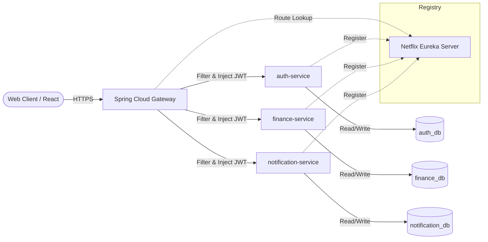
```mermaid
flowchart LR
    Client([Web Client / React]) -->|HTTPS| Gateway[Spring Cloud Gateway]
    
    Gateway -->|Filter & Inject JWT| AuthService[auth-service]
    Gateway -->|Filter & Inject JWT| FinanceService[finance-service]
    Gateway -->|Filter & Inject JWT| NotifyService[notification-service]
    
    AuthService -->|Read/Write| AuthDB[(auth_db)]
    FinanceService -->|Read/Write| FinanceDB[(finance_db)]
    NotifyService -->|Read/Write| NotifyDB[(notification_db)]
    
    subgraph Registry
        Eureka[Netflix Eureka Server]
    end
    
    Gateway -.->|Route Lookup| Eureka
    AuthService -.->|Register| Eureka
    FinanceService -.->|Register| Eureka
    NotifyService -.->|Register| Eureka
```

---

## 3. EPIC BREAKDOWN

Phân rã nghiệp vụ lớn (Epics) thành các phân hệ lõi.

| Epic ID | Epic Name | Target Service | Business Goal |
|---|---|---|---|
| `EPIC-01` | IAM & Security | `auth-service`, `gateway` | Định danh người dùng, cấp phát và thu hồi JWT an toàn. |
| `EPIC-02` | Core Ledger | `finance-service` | Ghi nhận dữ liệu thu/chi (Double-entry principle). Đảm bảo không sai số. |
| `EPIC-03` | Data Analytics | `finance-service` | Cung cấp cái nhìn tổng quan qua biểu đồ Aggregation tốc độ cao. |
| `EPIC-04` | Alert & Monitoring | `notification-service` | Chủ động cảnh báo khi user tiêu xài quá hạn mức (Budgeting). |

---

## 4. USER STORIES

| ID | User Story | SP | Priority | Dependencies | Risk Level |
|---|---|:---:|:---:|---|:---:|
| `US-1.1` | **As a** Guest, **I want to** register, **So that** I can use the system. | 5 | High | None | Low |
| `US-1.2` | **As a** User, **I want to** login, **So that** I can get a secure JWT. | 8 | Blocker | `US-1.1` | High (Security) |
| `US-2.1` | **As a** User, **I want to** add a transaction, **So that** I can track expenses. | 8 | Blocker | `US-1.2` | High (Data) |
| `US-2.2` | **As a** User, **I want to** scroll history, **So that** I can view past records. | 5 | Medium | `US-2.1` | Medium (Perf) |
| `US-3.1` | **As a** User, **I want to** view pie charts, **So that** I understand my habits. | 5 | High | `US-2.1` | Medium (Perf) |

---

## 5. ACCEPTANCE CRITERIA (BDD FORMAT)

**Story:** `US-2.1` (Add Transaction)

> **Scenario 1: Hợp lệ**
> **Given** User đã đăng nhập (Có JWT) và ở màn hình Dashboard
> **When** User nhập số tiền "50,000", chọn "Ăn uống" và nhấn "Lưu"
> **Then** Hệ thống trừ 50,000 khỏi Tổng số dư (Balance) và hiển thị Toast "Thành công".

> **Scenario 2: Vượt quá giới hạn (Max Amount Overflow)**
> **Given** User đã đăng nhập
> **When** User nhập số tiền "999,999,999,999,999" (10^15)
> **Then** Nút Submit bị block và UI báo đỏ "Số tiền quá lớn". API trả về 400 Bad Request nếu bypass UI.

---

## 6. REQUIREMENT TRACEABILITY MATRIX

| Requirement (US ID) | Target API Endpoint | Target Database | Processing Service | Test Cases Assigned |
|---|---|---|---|---|
| `US-1.2` Login | `POST /api/auth/login` | `auth_db.users` | `auth-service` | `TC-AUTH-01`, `SEC-01` |
| `US-2.1` Add Trx | `POST /api/transactions` | `finance_db.transactions` | `finance-service` | `TC-FIN-01`, `CON-01` |
| `US-3.1` View Chart | `GET /api/transactions/stats` | `finance_db.transactions` | `finance-service` | `TC-ANA-01`, `PERF-01` |

---

## 7. DEFINITION OF DONE (DoD)

Mọi Task (Ticket) chỉ được đánh dấu là **DONE** khi và chỉ khi hoàn thành toàn bộ Checklist sau:

- [x] Code đã được Push lên nhánh `feature/*` và tạo Pull Request (PR).
- [x] Đã vượt qua **Code Review** (Approve bởi ít nhất 1 Senior/Lead).
- [x] **Unit Test & Integration Test** được viết mới/cập nhật và PASS 100%.
- [x] Quét **SonarQube** đạt 0 Critical Bugs, 0 Vulnerabilities. Code Smell < 5%.
- [x] Quét bảo mật tự động (**Security Scan**) không phát hiện hổng JWT/CORS/Injection.
- [x] Đã cập nhật **API Documentation** (Swagger/OpenAPI).
- [x] **QA Pass:** Team QA đã test trên Staging và báo cáo 0 Blocker/Critical bugs.
- [x] Code đã được Merge vào nhánh `main` và **Deploy thành công lên Staging**.

---

## 8. SPRINT PLANNING

Dự án triển khai thành 3 Sprints (Mỗi Sprint 2 tuần).

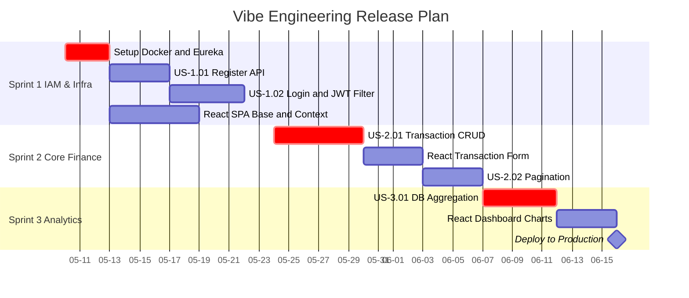
```mermaid
gantt
    title Vibe Engineering Release Plan
    dateFormat  YYYY-MM-DD
    axisFormat  %m-%d
    
    section Sprint 1 IAM & Infra
    Setup Docker and Eureka     :crit, a1, 2026-05-10, 3d
    US-1.01 Register API        :a2, after a1, 4d
    US-1.02 Login and JWT Filter:a3, after a2, 5d
    React SPA Base and Context  :a4, after a1, 6d
    
    section Sprint 2 Core Finance
    US-2.01 Transaction CRUD    :crit, b1, 2026-05-24, 6d
    React Transaction Form      :b2, after b1, 4d
    US-2.02 Pagination          :b3, after b2, 4d
    
    section Sprint 3 Analytics
    US-3.01 DB Aggregation      :crit, c1, 2026-06-07, 5d
    React Dashboard Charts      :c2, after c1, 4d
    Deploy to Production        :milestone, m1, 2026-06-16, 0d
```

| Sprint | Goal (Mục tiêu) | Task Name | SP | Owner |
|:---:|---|---|:---:|---|
| **1** | Móng hạ tầng & Phân quyền | Cấu hình Gateway JWT Filter + Auth Service | 13 | Backend Team |
| **1** | Móng hạ tầng & Phân quyền | Init React Vite, Context, Axios Interceptor | 8 | Frontend Team |
| **2** | Chức năng cốt lõi (Giao dịch)| CRUD Giao dịch (MongoDB Denormalization) | 13 | Fullstack Team |
| **2** | Chức năng cốt lõi (Giao dịch)| Cơ chế Infinite Scroll phân trang 20 items/page | 5 | Frontend Team |
| **3** | Phân tích & Tối ưu | Viết MongoDB Aggregation cho biểu đồ Thống kê | 8 | Backend Team |

---

## 9. RISK ANALYSIS

| Module | Risk (Rủi ro) | Impact (Hậu quả) | Mitigation Strategy (Kế hoạch giảm thiểu) |
|---|---|---|---|
| **Gateway** | Single Point of Failure (SPOF) - Sập Gateway. | Chết toàn hệ thống. | Triển khai Gateway theo Replica (tối thiểu 2 Pods). Load balancer kẹp ngoài. |
| **Finance** | Race Condition (Double submit) gây trùng lặp giao dịch. | Sai lệch số dư. | Frontend Debounce. Backend dùng Idempotency Key hoặc MongoDB Unique Index. |
| **Auth** | JWT Compromise (Lộ Token). | Hacker truy cập Data. | Set thời hạn JWT cực ngắn (15-60 phút). Cấp Refresh Token lưu dạng HttpOnly Cookie. |
| **Finance** | Aggregation Bottleneck khi Data phình to. | Lag hệ thống, Timeout 504. | Đánh Compound Index `{"userId": 1, "date": -1}`. |

---

## 10. DATABASE DESIGN & STRATEGY

- **Schema Type:** Schema-less (BSON Document).
- **Replica Set:** Setup `rs0` với 1 Primary, 2 Secondaries (Đọc từ Secondary để giảm tải cho Primary).
- **Denormalization:** Bảng `transactions` nhúng sẵn `categoryName`, `categoryColor` để bỏ qua phép `$lookup` (JOIN) đắt đỏ, đổi lấy Tốc độ Đọc (Read Performance).
- **Consistency Model:** Eventual Consistency (Tính nhất quán cuối cùng) cho việc Delete User (Sẽ xóa transaction ngầm qua Kafka Message Queue).
- **Auto Increment:** Dùng collection `counters` với `$inc` Atomic operation để tạo ID kiểu số nguyên thay cho ObjectId.

---

## 11. API DESIGN & STANDARDS

Chuẩn thiết kế RESTful nghiêm ngặt. Phản hồi luôn tuân theo cấu trúc JSend chuẩn hóa.

| API Endpoint | Method | Auth | Description | Status Codes |
|---|:---:|:---:|---|---|
| `/api/auth/login` | `POST` | No | Nhận credentials, trả JWT. | 200 (OK), 401 (Invalid) |
| `/api/transactions/`| `GET` | Yes | Lấy danh sách giao dịch (Pagination). | 200 (OK), 401 (Unauthorized) |
| `/api/transactions/`| `POST` | Yes | Tạo giao dịch mới. | 201 (Created), 400 (Bad Req) |
| `/api/transactions/stats`| `GET` | Yes | Lấy dữ liệu Aggregation Biểu đồ. | 200 (OK) |

---

## 12. TEST STRATEGY

Chiến lược bao phủ mọi tầng tháp (Test Pyramid):
- **Unit Testing:** Bao phủ 80% logic tính toán (Tính tổng, tính %), Mock Data bằng `Mockito`.
- **Integration Testing:** Test luồng API Gateway đi xuyên qua `finance-service` xuống tới MongoDB (dùng `Testcontainers`).
- **E2E Testing:** Kịch bản Playwright click chuột thật trên trình duyệt ẩn (Headless).
- **Security Testing:** Tấn công tự động (DAST) quét XSS, dò tìm Token hết hạn.
- **Accessibility (A11y):** Đo bằng Lighthouse (Mục tiêu > 90 điểm), test Keyboard Navigation bằng phím Tab.

---

## 13. SECURITY STRATEGY

Bảo vệ cấp Doanh nghiệp (Enterprise-grade Security):
- **Data at Rest:** MongoDB Transparent Data Encryption (TDE) bảo vệ dữ liệu vật lý.
- **Data in Transit:** Bắt buộc 100% giao tiếp qua `HTTPS/TLS 1.3`.
- **JWT Protection:** Không lưu Refresh Token ở LocalStorage (Tránh XSS). Payload không chứa mật khẩu.
- **RBAC (Role-Based Access Control):** Gateway giải mã JWT, chèn `X-User-Role` và `X-User-Id` vào Header nội bộ. Tránh IDOR (Sửa/Xóa nhầm của người khác).
- **Rate Limiting:** Gateway tích hợp Redis RateLimiter chặn spam (Ví dụ: 10 req/s cho Login).

---

## 14. PERFORMANCE & SCALABILITY

- **Horizontal Scaling:** Spring Boot Services hoàn toàn **Stateless**. Có thể scale từ 1 lên 10 instances. Eureka sẽ tự cân bằng tải (Client-side Load Balancing qua Spring Cloud LoadBalancer).
- **Caching:** Cache danh mục (Categories) tĩnh bằng Redis để giảm I/O cho MongoDB.
- **Throughput:** Mục tiêu xử lý 2,000 TPS (Transactions per second).
- **Latency:** Cam kết P95 Latency < 200ms cho các API CRUD.

---

## 15. OBSERVABILITY & MONITORING

Hệ thống cung cấp góc nhìn X-Ray toàn diện:
- **Tracing:** `Micrometer Tracing` + `Zipkin`. Theo dõi 1 request tốn bao nhiêu ms ở Gateway, bao nhiêu ms ở Finance, bao nhiêu ms ở DB.
- **Metrics:** `Prometheus` pull dữ liệu Memory/CPU từ Spring Actuator. Cảnh báo qua `Grafana` khi Memory JVM > 85%.
- **Logs:** Triển khai `ELK Stack`. Format log chuẩn JSON. Tất cả log đều có `traceId` chung để lọc chuỗi sự kiện dễ dàng.

---

## 16. CI/CD & AUTOMATION

Quy trình DevOps không độ trễ (Zero-touch deployment):
- **Code Push:** Trigger **GitHub Actions**.
- **Build Phase:** Maven Build -> Chạy Unit Test -> Quét SonarQube.
- **Image Build:** Gói ứng dụng vào Docker Image (Alpine-based siêu nhẹ).
- **Push:** Đẩy lên Docker Hub hoặc AWS ECR.
- **Deploy:** Webhook kích hoạt server tự kéo Image mới về và restart bằng `docker-compose up -d`. Toàn bộ quá trình < 3 phút.

---

## 17. UAT & EXIT CRITERIA

Tiêu chí nghiệm thu hệ thống trước khi Go-Live cho người dùng cuối (End-User).

| Criteria (Tiêu chí) | Threshold (Ngưỡng yêu cầu bắt buộc) |
|---|---|
| **Pass Rate (Functional)** | Đạt 100% đối với Critical & Blocker test cases. |
| **Code Coverage** | >= 80% (Quét bằng công cụ JaCoCo). |
| **Performance SLA** | Latency trung bình < 200ms (Load 1000 CCU đồng thời). |
| **Security SLA** | 0% lỗ hổng bảo mật rủi ro cao (High/Critical) từ báo cáo Penetration Test. |
| **UAT Approval** | Được Product Owner (PO) ký xác nhận hoàn thành Acceptance Criteria. |

---

## 18. SEQUENCE DIAGRAMS

Mô tả luồng giao tiếp đồng bộ (Synchronous Flows) giữa các thành phần. Đảm bảo tính bảo mật và toàn vẹn dữ liệu.

### 18.1. Login Flow & JWT Generation
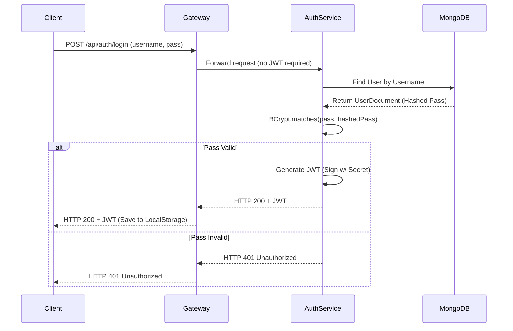
```mermaid
sequenceDiagram
    participant Client
    participant Gateway
    participant AuthService
    participant MongoDB

    Client->>Gateway: POST /api/auth/login (username, pass)
    Gateway->>AuthService: Forward request (no JWT required)
    AuthService->>MongoDB: Find User by Username
    MongoDB-->>AuthService: Return UserDocument (Hashed Pass)
    AuthService->>AuthService: BCrypt.matches(pass, hashedPass)
    alt Pass Valid
        AuthService->>AuthService: Generate JWT (Sign w/ Secret)
        AuthService-->>Gateway: HTTP 200 + JWT
        Gateway-->>Client: HTTP 200 + JWT (Save to LocalStorage)
    else Pass Invalid
        AuthService-->>Gateway: HTTP 401 Unauthorized
        Gateway-->>Client: HTTP 401 Unauthorized
    end
```

### 18.2. Add Transaction Flow (JWT Validation)
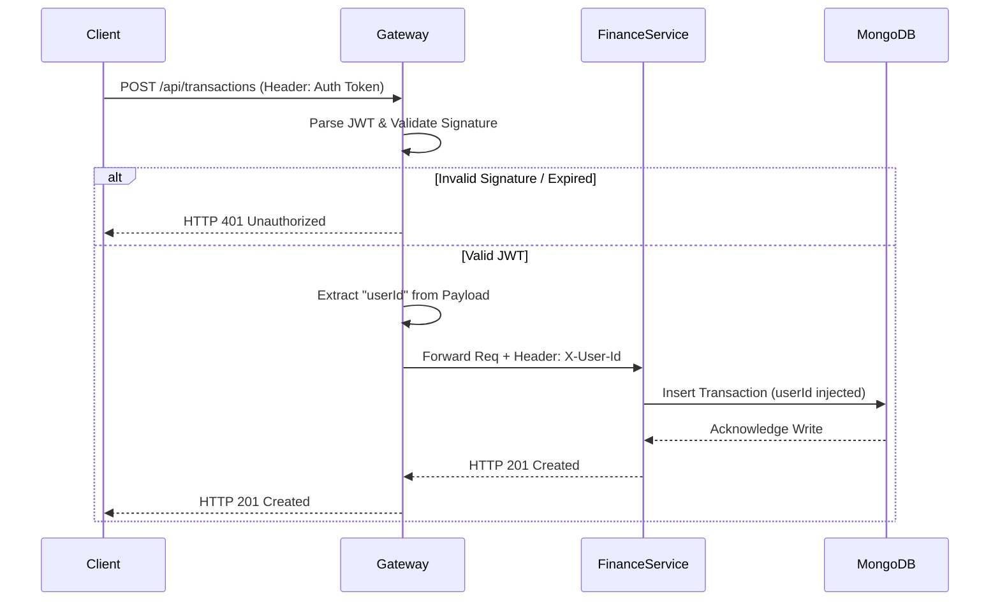
```mermaid
sequenceDiagram
    participant Client
    participant Gateway
    participant FinanceService
    participant MongoDB

    Client->>Gateway: POST /api/transactions (Header: Auth Token)
    Gateway->>Gateway: Parse JWT & Validate Signature
    alt Invalid Signature / Expired
        Gateway-->>Client: HTTP 401 Unauthorized
    else Valid JWT
        Gateway->>Gateway: Extract "userId" from Payload
        Gateway->>FinanceService: Forward Req + Header: X-User-Id
        FinanceService->>MongoDB: Insert Transaction (userId injected)
        MongoDB-->>FinanceService: Acknowledge Write
        FinanceService-->>Gateway: HTTP 201 Created
        Gateway-->>Client: HTTP 201 Created
    end
```

### 18.3. Register Flow
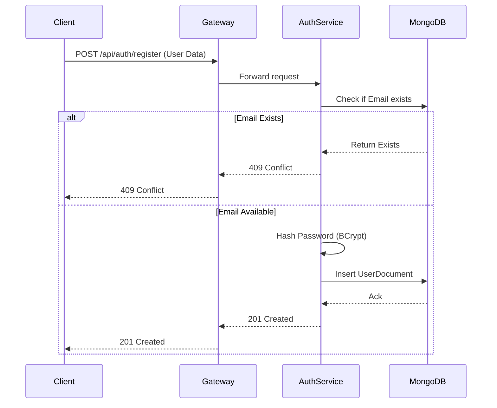
```mermaid
sequenceDiagram
    participant Client
    participant Gateway
    participant AuthService
    participant MongoDB

    Client->>Gateway: POST /api/auth/register (User Data)
    Gateway->>AuthService: Forward request
    AuthService->>MongoDB: Check if Email exists
    alt Email Exists
        MongoDB-->>AuthService: Return Exists
        AuthService-->>Gateway: 409 Conflict
        Gateway-->>Client: 409 Conflict
    else Email Available
        AuthService->>AuthService: Hash Password (BCrypt)
        AuthService->>MongoDB: Insert UserDocument
        MongoDB-->>AuthService: Ack
        AuthService-->>Gateway: 201 Created
        Gateway-->>Client: 201 Created
    end
```

### 18.4. Refresh Token Flow
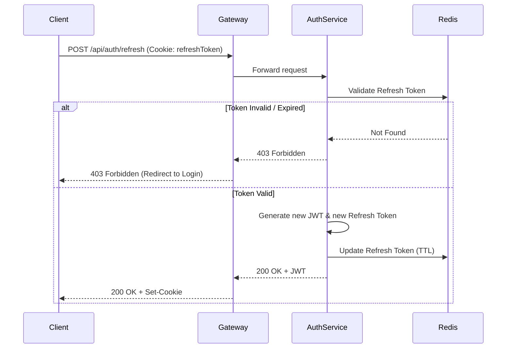
```mermaid
sequenceDiagram
    participant Client
    participant Gateway
    participant AuthService
    participant Redis

    Client->>Gateway: POST /api/auth/refresh (Cookie: refreshToken)
    Gateway->>AuthService: Forward request
    AuthService->>Redis: Validate Refresh Token
    alt Token Invalid / Expired
        Redis-->>AuthService: Not Found
        AuthService-->>Gateway: 403 Forbidden
        Gateway-->>Client: 403 Forbidden (Redirect to Login)
    else Token Valid
        AuthService->>AuthService: Generate new JWT & new Refresh Token
        AuthService->>Redis: Update Refresh Token (TTL)
        AuthService-->>Gateway: 200 OK + JWT
        Gateway-->>Client: 200 OK + Set-Cookie
    end
```

### 18.5. Logout Flow
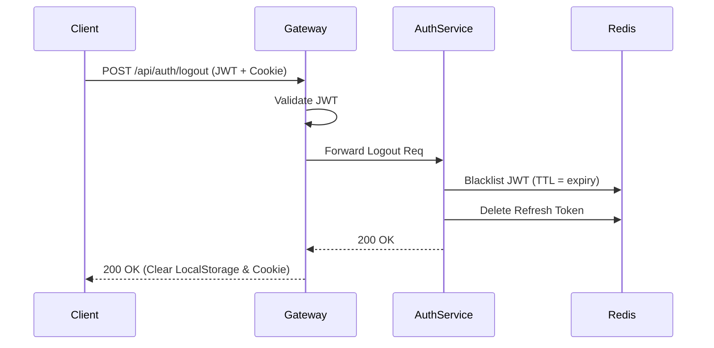
```mermaid
sequenceDiagram
    participant Client
    participant Gateway
    participant AuthService
    participant Redis

    Client->>Gateway: POST /api/auth/logout (JWT + Cookie)
    Gateway->>Gateway: Validate JWT
    Gateway->>AuthService: Forward Logout Req
    AuthService->>Redis: Blacklist JWT (TTL = expiry)
    AuthService->>Redis: Delete Refresh Token
    AuthService-->>Gateway: 200 OK
    Gateway-->>Client: 200 OK (Clear LocalStorage & Cookie)
```

### 18.6. Delete Transaction Flow
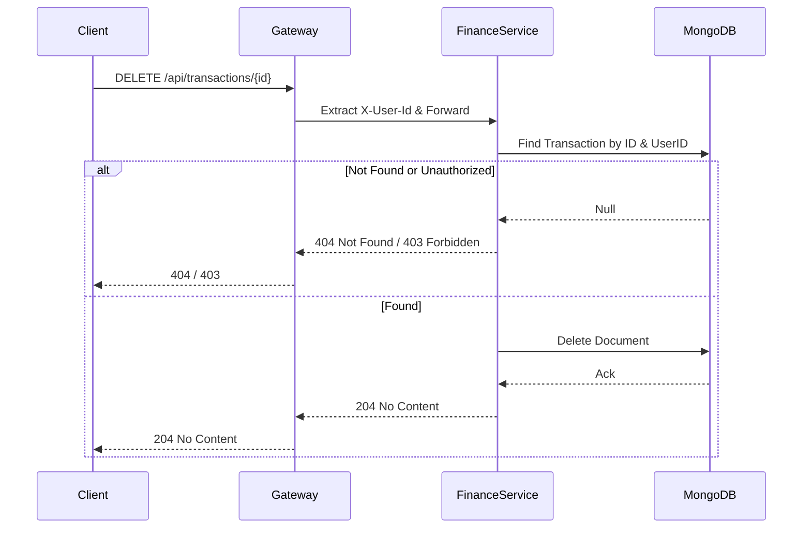
```mermaid
sequenceDiagram
    participant Client
    participant Gateway
    participant FinanceService
    participant MongoDB

    Client->>Gateway: DELETE /api/transactions/{id}
    Gateway->>FinanceService: Extract X-User-Id & Forward
    FinanceService->>MongoDB: Find Transaction by ID & UserID
    alt Not Found or Unauthorized
        MongoDB-->>FinanceService: Null
        FinanceService-->>Gateway: 404 Not Found / 403 Forbidden
        Gateway-->>Client: 404 / 403
    else Found
        FinanceService->>MongoDB: Delete Document
        MongoDB-->>FinanceService: Ack
        FinanceService-->>Gateway: 204 No Content
        Gateway-->>Client: 204 No Content
    end
```

### 18.7. Analytics Aggregation Flow
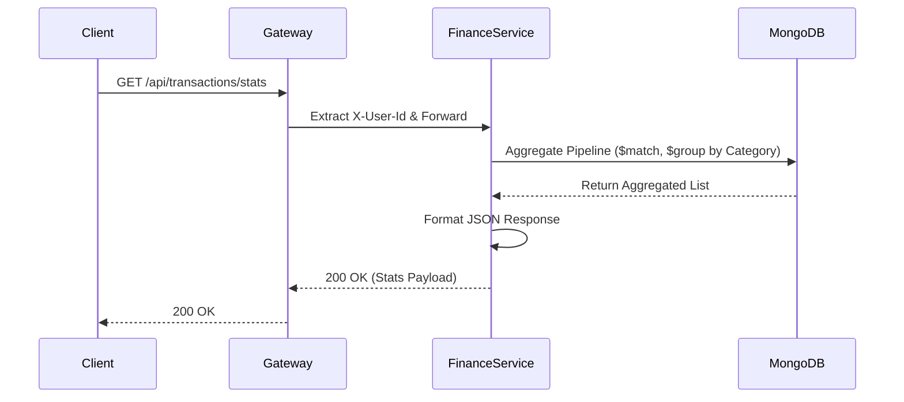
```mermaid
sequenceDiagram
    participant Client
    participant Gateway
    participant FinanceService
    participant MongoDB

    Client->>Gateway: GET /api/transactions/stats
    Gateway->>FinanceService: Extract X-User-Id & Forward
    FinanceService->>MongoDB: Aggregate Pipeline ($match, $group by Category)
    MongoDB-->>FinanceService: Return Aggregated List
    FinanceService->>FinanceService: Format JSON Response
    FinanceService-->>Gateway: 200 OK (Stats Payload)
    Gateway-->>Client: 200 OK
```

### 18.8. Notification Polling Flow
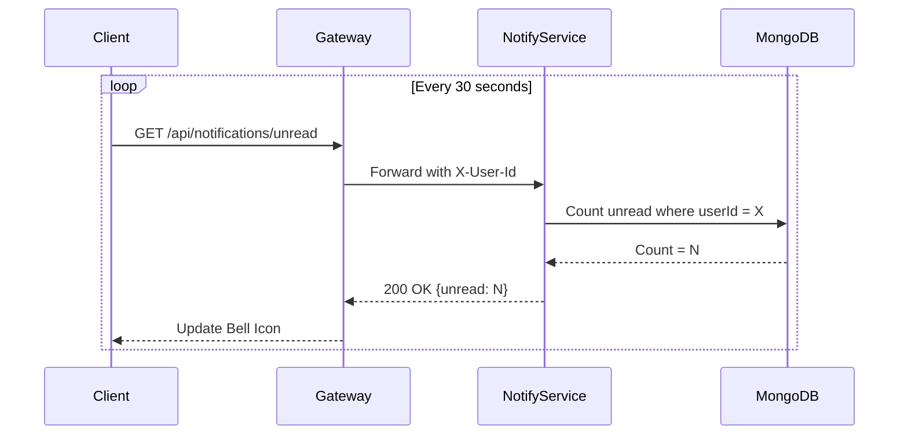
```mermaid
sequenceDiagram
    participant Client
    participant Gateway
    participant NotifyService
    participant MongoDB

    loop Every 30 seconds
        Client->>Gateway: GET /api/notifications/unread
        Gateway->>NotifyService: Forward with X-User-Id
        NotifyService->>MongoDB: Count unread where userId = X
        MongoDB-->>NotifyService: Count = N
        NotifyService-->>Gateway: 200 OK {unread: N}
        Gateway-->>Client: Update Bell Icon
    end
```

### 18.9. Cache Flow (Redis Cache-Aside Pattern)
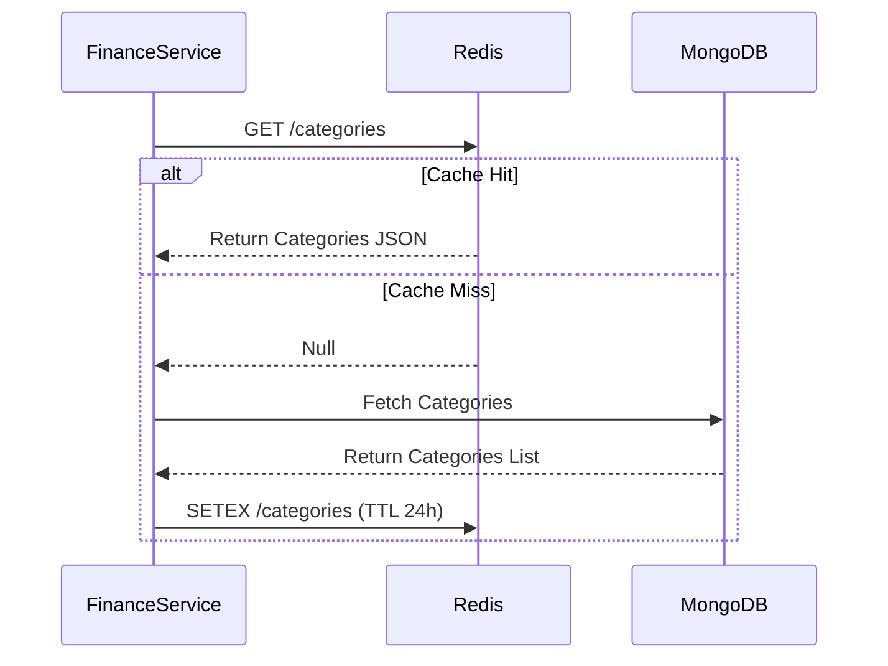
```mermaid
sequenceDiagram
    participant FinanceService
    participant Redis
    participant MongoDB

    FinanceService->>Redis: GET /categories
    alt Cache Hit
        Redis-->>FinanceService: Return Categories JSON
    else Cache Miss
        Redis-->>FinanceService: Null
        FinanceService->>MongoDB: Fetch Categories
        MongoDB-->>FinanceService: Return Categories List
        FinanceService->>Redis: SETEX /categories (TTL 24h)
    end
```

### 18.10. Retry Flow (Spring Retry / Resilience4j)
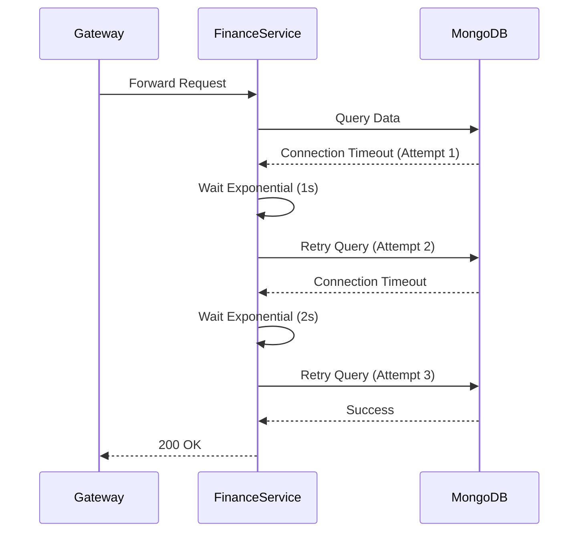
```mermaid
sequenceDiagram
    participant Gateway
    participant FinanceService
    participant MongoDB

    Gateway->>FinanceService: Forward Request
    FinanceService->>MongoDB: Query Data
    MongoDB-->>FinanceService: Connection Timeout (Attempt 1)
    FinanceService->>FinanceService: Wait Exponential (1s)
    FinanceService->>MongoDB: Retry Query (Attempt 2)
    MongoDB-->>FinanceService: Connection Timeout
    FinanceService->>FinanceService: Wait Exponential (2s)
    FinanceService->>MongoDB: Retry Query (Attempt 3)
    MongoDB-->>FinanceService: Success
    FinanceService-->>Gateway: 200 OK
```

### 18.11. Error Flow (Global Exception Handler)
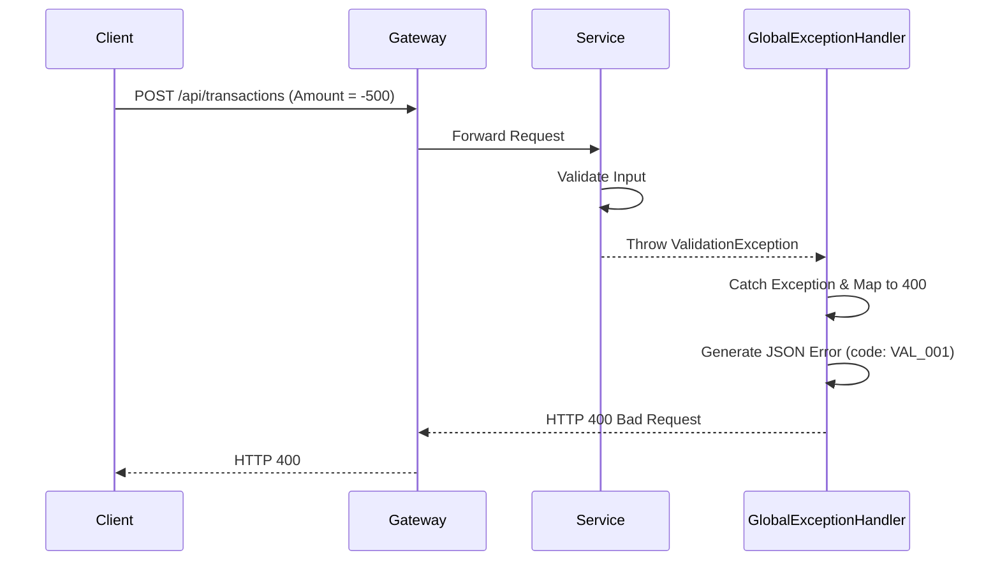
```mermaid
sequenceDiagram
    participant Client
    participant Gateway
    participant Service
    participant GlobalExceptionHandler

    Client->>Gateway: POST /api/transactions (Amount = -500)
    Gateway->>Service: Forward Request
    Service->>Service: Validate Input
    Service-->>GlobalExceptionHandler: Throw ValidationException
    GlobalExceptionHandler->>GlobalExceptionHandler: Catch Exception & Map to 400
    GlobalExceptionHandler->>GlobalExceptionHandler: Generate JSON Error (code: VAL_001)
    GlobalExceptionHandler-->>Gateway: HTTP 400 Bad Request
    Gateway-->>Client: HTTP 400
```

### 18.12. DLQ Flow (Dead Letter Queue)
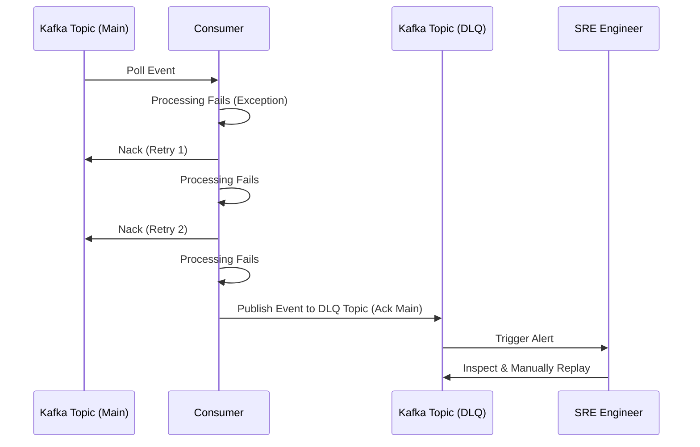
```mermaid
sequenceDiagram
    participant Kafka Topic (Main)
    participant Consumer
    participant Kafka Topic (DLQ)
    participant SRE Engineer

    Kafka Topic (Main)->>Consumer: Poll Event
    Consumer->>Consumer: Processing Fails (Exception)
    Consumer->>Kafka Topic (Main): Nack (Retry 1)
    Consumer->>Consumer: Processing Fails
    Consumer->>Kafka Topic (Main): Nack (Retry 2)
    Consumer->>Consumer: Processing Fails
    Consumer->>Kafka Topic (DLQ): Publish Event to DLQ Topic (Ack Main)
    Kafka Topic (DLQ)->>SRE Engineer: Trigger Alert
    SRE Engineer->>Kafka Topic (DLQ): Inspect & Manually Replay
```

### 18.13. Distributed Trace Flow
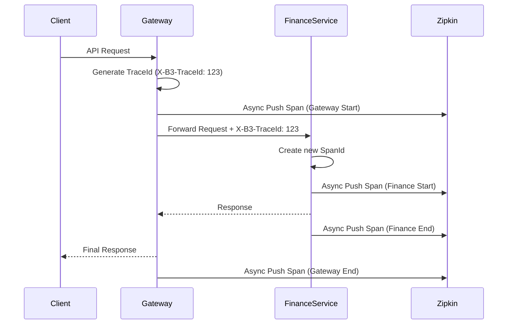
```mermaid
sequenceDiagram
    participant Client
    participant Gateway
    participant FinanceService
    participant Zipkin

    Client->>Gateway: API Request
    Gateway->>Gateway: Generate TraceId (X-B3-TraceId: 123)
    Gateway->>Zipkin: Async Push Span (Gateway Start)
    Gateway->>FinanceService: Forward Request + X-B3-TraceId: 123
    FinanceService->>FinanceService: Create new SpanId
    FinanceService->>Zipkin: Async Push Span (Finance Start)
    FinanceService-->>Gateway: Response
    FinanceService->>Zipkin: Async Push Span (Finance End)
    Gateway-->>Client: Final Response
    Gateway->>Zipkin: Async Push Span (Gateway End)
```

### 18.14. Audit Logging Flow
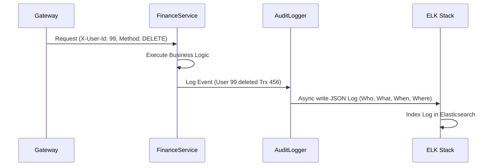
```mermaid
sequenceDiagram
    participant Gateway
    participant FinanceService
    participant AuditLogger
    participant ELK Stack

    Gateway->>FinanceService: Request (X-User-Id: 99, Method: DELETE)
    FinanceService->>FinanceService: Execute Business Logic
    FinanceService->>AuditLogger: Log Event (User 99 deleted Trx 456)
    AuditLogger->>ELK Stack: Async write JSON Log (Who, What, When, Where)
    ELK Stack->>ELK Stack: Index Log in Elasticsearch
```

---

## 19. RUNTIME FLOW & EVENTUAL CONSISTENCY

Đặc tả giao tiếp bất đồng bộ (Asynchronous Flow) sử dụng Message Queue, đảm bảo hiệu năng cao và Tính Nhất Quán Cuối Cùng (Eventual Consistency).

### 19.1. User Deletion Flow (Saga / Choreography Pattern)
Khi một User bị xóa, dữ liệu giao dịch của họ ở `finance-service` cũng phải bị xóa theo để tuân thủ chuẩn GDPR, nhưng không thực hiện đồng bộ (Synchronous) để tránh block API.

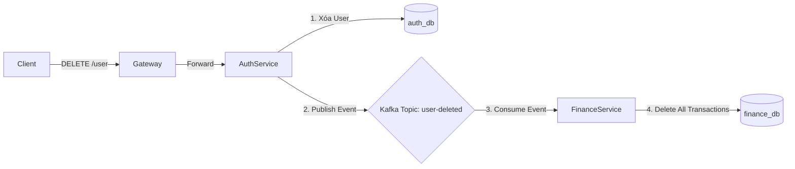
```mermaid
flowchart LR
    Client -->|DELETE /user| Gateway
    Gateway -->|Forward| AuthService
    AuthService -->|1. Xóa User| AuthDB[(auth_db)]
    AuthService -->|2. Publish Event| Kafka{Kafka Topic: user-deleted}
    Kafka -->|3. Consume Event| FinanceService
    FinanceService -->|4. Delete All Transactions| FinanceDB[(finance_db)]
```
- **Producer:** `auth-service` bắn event `UserDeletedEvent` vào Kafka.
- **Consumer:** `finance-service` subscribe topic và tự động xóa data rác.
- **Dead-Letter Queue (DLQ):** Nếu `finance-service` sập lúc Kafka gửi event, message sẽ được lưu lại (Retain). Khi khởi động lại, service tự động kéo (Pull) lại để đồng bộ (Retry Policy = 3 lần -> DLQ).

---

## 20. ERROR HANDLING STANDARD

Mọi dịch vụ phải ném lỗi (Throw Exception) qua bộ lọc **GlobalExceptionHandler** (`@ControllerAdvice`) để chuẩn hóa về đúng một format duy nhất (Enterprise Error Contract).

### 20.1. Error HTTP Standard Mapping
| Error Code | HTTP Status | Description |
|---|---|---|
| `AUTH_001` | 401 Unauthorized | Sai thông tin đăng nhập (Invalid Credentials). |
| `AUTH_002` | 403 Forbidden | Token hết hạn hoặc chữ ký bị giả mạo. |
| `VAL_001` | 400 Bad Request | Lỗi Validation (Amount < 0, thiếu title). |
| `SYS_500` | 500 Internal Error | Lỗi đứt kết nối DB, NullPointerException. |
| `DB_001` | 409 Conflict | Trùng lặp khóa chính (Race Condition/Optimistic Locking). |

### 20.2. Chuẩn JSON Error Response
```json
{
  "success": false,
  "error": {
    "code": "VAL_001",
    "message": "Validation Failed",
    "details": ["Amount must be greater than zero", "Title cannot be blank"]
  },
  "traceId": "65b9d3e8-712f-4a92-b2d9",
  "timestamp": "2026-05-08T10:00:00Z"
}
```

---

## 21. DOMAIN MODELING (DDD)

Áp dụng phương pháp luận Domain-Driven Design (DDD) để vạch rõ ranh giới các Context (Bounded Contexts) và tránh các service "thò tay" trực tiếp vào DB của nhau.

| Bounded Context | Owner Service | Responsibility |
|---|---|---|
| **Identity & Access** | `auth-service` | Quản lý User, Hash Pass, JWT Lifecycle. |
| **Core Ledger** | `finance-service` | Sổ cái ghi chép thu/chi, số dư (Balance). |
| **Notification** | `notification-service`| Gửi cảnh báo hệ thống, Alert ngân sách. |

### 21.1. Aggregate Roots
| Aggregate Root | Entities / Value Objects | Domain Events |
|---|---|---|
| `UserAggregate` | Entity: `User` <br> Value Object: `Preferences` | `UserCreated`, `UserDeleted` |
| `TransactionAggregate`| Entity: `Transaction` <br> Value Object: `MoneyAmount` | `TransactionAdded`, `BudgetExceeded` |

---

## 22. C4 MODEL ARCHITECTURE

Mô hình C4 cung cấp cái nhìn đa góc độ từ phi kỹ thuật đến mức độ Component Code.

### 22.1. Context Diagram
Mô tả hệ thống ở góc độ Người dùng.
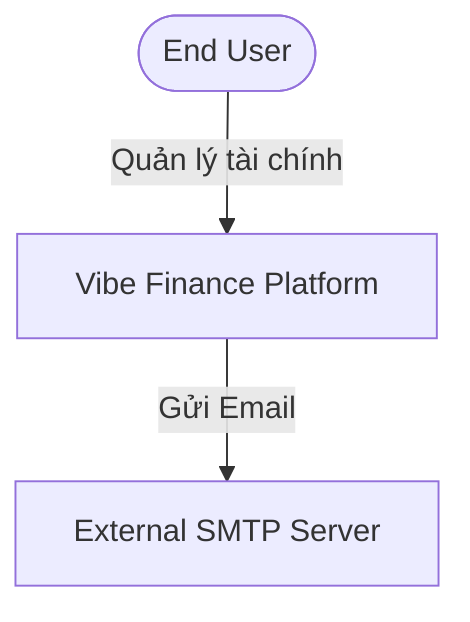
```mermaid
flowchart TD
    User([End User]) -->|Quản lý tài chính| Platform[Vibe Finance Platform]
    Platform -->|Gửi Email| SMTP[External SMTP Server]
```

### 22.2. Container Diagram
Kiến trúc Microservices vật lý.
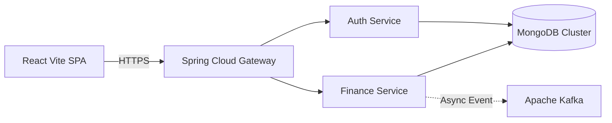
```mermaid
flowchart LR
    SPA[React Vite SPA] -->|HTTPS| API_Gateway[Spring Cloud Gateway]
    API_Gateway --> Auth[Auth Service]
    API_Gateway --> Finance[Finance Service]
    Auth --> MongoDB[(MongoDB Cluster)]
    Finance --> MongoDB
    Finance -.->|Async Event| Kafka[Apache Kafka]
```

### 22.3. Component Diagram (Finance Service)
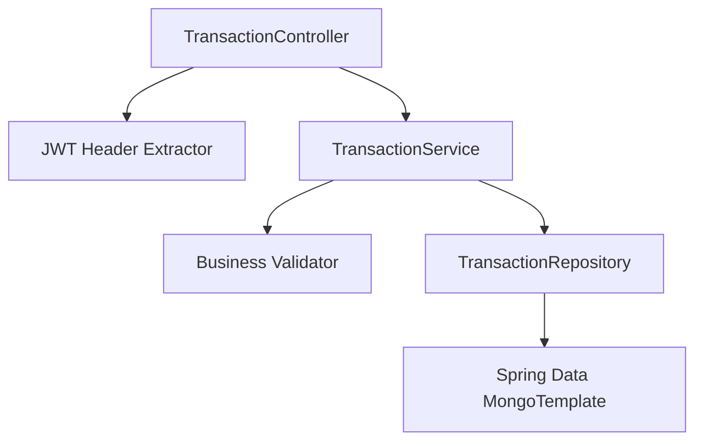
```mermaid
flowchart TD
    Controller[TransactionController] --> Filter[JWT Header Extractor]
    Controller --> Service[TransactionService]
    Service --> Validator[Business Validator]
    Service --> Repo[TransactionRepository]
    Repo --> MongoTemplate[Spring Data MongoTemplate]
```

---

## 23. SECRET MANAGEMENT

Quản lý thông tin nhạy cảm (Credentials) theo chuẩn Zero-Trust và nguyên tắc đặc quyền tối thiểu (Least Privilege). Tuyệt đối **không Hardcode** mật khẩu trong code.

| Secret Type | Storage Method | Injection Method | Rotation Policy |
|---|---|---|---|
| **JWT_SECRET** | GitHub Secrets / Vault | Docker Environment Variables | Xoay vòng mỗi 90 ngày. |
| **DB_PASSWORD**| AWS Secrets Manager | Spring Boot `application.yml` via ENV | Xoay vòng mỗi 180 ngày. |
| **API Keys** | Azure Key Vault | K8s Secrets | Thu hồi ngay lập tức nếu nhân sự nghỉ việc. |

---

## 24. OBSERVABILITY & MONITORING (DEEP DIVE)

Stack "Rắn Mặt" để vận hành an toàn trên Production (SRE Standard).

| Công cụ (Tool) | Nhiệm vụ (Purpose) | Kỹ thuật triển khai (Implementation) |
|---|---|---|
| **Prometheus** | Thu thập Metrics | Cào số liệu từ `actuator/prometheus` (CPU, RAM, Hikari Pool, JVM Threads). |
| **Grafana** | Alerting & Dashboard| Hiển thị biểu đồ P95 Latency. Gửi cảnh báo Telegram nếu Error Rate > 5%. |
| **ELK Stack** | Log tập trung | Logstash đọc file log JSON. Kibana tìm kiếm nhanh log lỗi theo `X-Correlation-Id`. |
| **Zipkin / Sleuth**| Distributed Tracing | Vẽ sơ đồ mạng nhện request nhảy từ Gateway -> Auth -> DB mất bao nhiêu miligiây. |

### 24.1. Luồng Tracing qua Microservices
```mermaid
flowchart LR
    Gateway[Gateway: X-B3-TraceId=123] --> Finance[Finance: X-B3-TraceId=123]
    Finance --> Zipkin[(Zipkin Server)]
    Gateway --> Zipkin
    Zipkin --> Grafana[Grafana Dashboard]
```

---

## 25. DEPLOYMENT & INFRASTRUCTURE

Sử dụng Docker Compose cho Staging/Local và Kubernetes/ECS cho Production để Scale chiều ngang (Horizontal Scaling).

```mermaid
flowchart TB
    Internet((Internet)) --> WAF[Cloudflare WAF / DNS]
    WAF --> LB[Nginx Load Balancer]
    LB --> GW1[Gateway Pod 1]
    LB --> GW2[Gateway Pod 2]
    GW1 --> F1[Finance Service Pods]
    GW2 --> F1
    F1 --> MongoDB[(MongoDB Atlas Replica Set)]
```

---

## 26. BACKUP & DISASTER RECOVERY

Chiến lược ứng phó thảm họa mất dữ liệu (SRE Disaster Recovery).

- **RPO (Recovery Point Objective):** < 15 phút. (Dữ liệu tối đa có thể mất khi có thảm họa là 15 phút).
- **RTO (Recovery Time Objective):** < 1 giờ. (Hệ thống phải hoạt động lại trong vòng 1 tiếng).
- **Backup Strategy:** 
  - MongoDB Atlas tự động chạy Daily Snapshot (Backup vật lý toàn cụm).
  - Continuous Backup qua Oplog (Khôi phục dữ liệu tại bất kỳ mili-giây nào trong quá khứ - Point-In-Time Recovery).
- **Failover Strategy:** Nếu Data Center A (Primary) sập, Data Center B (Secondary) sẽ tự động kích hoạt tiến trình Bầu cử (Election) để lên làm Primary trong 2-3 giây. Không downtime.

---

## 27. API GOVERNANCE

Kiểm soát chặt chẽ hợp đồng API (API Contract) giữa Frontend và Backend.

| Pattern | Mô tả | 
|---|---|
| **API Versioning** | Luôn nhúng version vào URI (VD: `/api/v1/transactions`). |
| **Backward Compatibility** | Khi thêm field mới vào Response, phiên bản `v1` cũ không được Crash. Cấm sửa field hiện tại. |
| **OpenAPI/Swagger** | Mọi API phải sinh Swagger tự động từ code (Code-first approach). |

---

## 28. AUDIT LOGGING

Ghi nhận lại mọi thao tác nhảy cảm (Security Events) để phục vụ cho các đợt Thanh tra Bảo mật (Security Audit).

- **Ai làm (Who):** Lấy từ `X-User-Id` do Gateway cung cấp.
- **Làm gì (What):** Thực hiện hành động `DELETE_TRANSACTION`.
- **Lúc nào (When):** Timestamp chuẩn UTC (VD: `2026-05-08T10:05:00Z`).
- **Trên tài nguyên nào (Where):** `TransactionId: 65a...` và `Client-IP: 192.168.x.x`.

---

## 29. PERFORMANCE ENGINEERING

Tối ưu hóa sức mạnh của JVM và Database.

- **Throughput & TPS:** Đảm bảo hệ thống chịu được 2,000 Transactions Per Second (TPS).
- **Cache Hit Ratio:** Redis phải đạt tỷ lệ Cache Hit > 80% đối với các API cấu hình, Preferences tĩnh.
- **Connection Pooling:** Cấu hình HikariCP `maximum-pool-size = 20` để chống thắt cổ chai kết nối Database.
- **JVM Tuning:** Sử dụng thuật toán dọn rác ZGC (Z Garbage Collector) trên Java 17 để tránh hiện tượng STW (Stop The World) gây khựng API.

---

## 30. SECURITY HARDENING

Áp dụng chuẩn OWASP Top 10 và các biện pháp phòng vệ chiều sâu (Defense-in-Depth).

- **XSS Mitigation:** Framework React tự động escape HTML khi render nội dung (Ngăn chặn `<script>alert(1)</script>`).
- **CSRF Protection:** Vì hệ thống sử dụng Token-based Auth (JWT gửi qua Header HTTP) thay vì Cookie, lỗi CSRF hoàn toàn bị vô hiệu hóa.
- **IDOR Prevention:** (Insecure Direct Object Reference) - Finance Service luôn tự động ép điều kiện truy vấn `where userId = {X-User-Id}` lấy từ Gateway, không bao giờ tin tưởng `userId` do Client gửi lên.
- **Zero Trust:** Ngay cả khi các service nằm chung một mạng nội bộ (Internal Docker Network), chúng vẫn phải gọi nhau qua Gateway/Token để xác thực định danh.

---

## 31. SRE, RESILIENCY & FAULT TOLERANCE

Thiết kế độ bền bỉ (Resiliency) chống Cascading Failure bằng Spring Cloud Circuit Breaker (Resilience4j).

- **Circuit Breaker Pattern:** Gateway bọc các request tới `finance-service` bằng Circuit Breaker. Nếu tỷ lệ lỗi > 50% trong 10s, ngắt mạch (Open state) và trả về Fallback Response (Cache hoặc Error Code 503) ngay lập tức, không đợi Timeout.
- **Bulkhead Pattern:** Giới hạn Thread Pool độc lập cho từng Route trên Gateway. Nếu `notification-service` bị treo, nó chỉ cạn kiệt Thread Pool của chính nó, không làm sập luồng gọi tới `auth-service`.
- **Graceful Shutdown:** Tích hợp `server.shutdown=graceful`. Khi K8s gửi tín hiệu SIGTERM, ứng dụng ngưng nhận request mới, hoàn tất xử lý các request đang dở dang trong tối đa 30s trước khi kill process. Tránh rớt data.
- **Canary Deployment:** Triển khai tính năng mới theo tỷ lệ (Traffic Shifting). Định tuyến 5% user (dựa trên Header hoặc User-Id) vào version v2, 95% vào version v1 để theo dõi Error Rate trước khi rollout 100%.

---

## 32. EVENTUAL CONSISTENCY & OUTBOX PATTERN

Bảo vệ tính toàn vẹn dữ liệu phân tán (Distributed Data Integrity) chống lại nguy cơ Dual-Write.

- **Transactional Outbox Pattern:** `auth-service` khi xóa user sẽ không gọi trực tiếp Kafka. Thay vào đó, nó ghi sự kiện `UserDeleted` vào table `outbox_events` chung một DB Transaction với thao tác Xóa User. Một tiến trình nền (Debezium CDC hoặc Polling) sẽ quét bảng `outbox` và đẩy lên Kafka. Đảm bảo tính "At-least-once delivery".
- **Idempotency Flow:** `finance-service` (Consumer) lưu lại `eventId` đã xử lý vào collection `processed_events`. Nếu Kafka gửi lại event (Duplicate), Consumer check DB thấy đã xử lý -> Bỏ qua. Đảm bảo tính "Exactly-once delivery".
- **Dead-Letter Queue (DLQ):** Message lỗi sau 3 lần Retry Exponential Backoff sẽ bị đẩy vào DLQ. Kỹ sư SRE sẽ review và Replay lại thủ công.

---

## 33. ERROR HANDLING TAXONOMY

Phân loại Exception để quy định chiến lược Retry.

- **Business Exception (Non-Retryable):** Các lỗi như `InsufficientBalanceException` (400) hoặc `UserNotFoundException` (404). Client **KHÔNG ĐƯỢC** retry vì kết quả luôn fail. Gateway trả lỗi ngay.
- **Technical Exception (Retryable):** Các lỗi như `MongoTimeoutException` (500) hoặc `503 Service Unavailable`. Spring Retry sẽ tự động thử lại tối đa 3 lần, giãn cách theo hàm mũ (Exponential Backoff: 1s, 2s, 4s).

---

## 34. OBSERVABILITY: GOLDEN SIGNALS & SLOs

Cam kết SLA (Service Level Agreement) và SLI (Service Level Indicator) đo bằng Prometheus.

- **Traffic:** Hệ thống phải duy trì Throughput tối đa 5000 TPS.
- **Latency (SLO):** 99% request (P99) vào `finance-service` phải phản hồi dưới 150ms.
- **Errors (SLO):** Tỷ lệ HTTP 5xx phải dưới 0.1% trong window 30 ngày (Error Budget).
- **Saturation:** Cảnh báo PagerDuty khi MongoDB Disk Utilization > 75% hoặc Hikari Pool Active Connections > 90%.

---

## 35. QA & ADVANCED TESTING STRATEGY

- **Contract Testing:** Sử dụng Pact để đảm bảo thay đổi API ở `finance-service` (Provider) không làm gãy luồng gọi của Frontend React (Consumer).
- **Mutation Testing:** Dùng PITest (Java) chèn ngẫu nhiên các lỗi logic vào code (`+` thành `-`) để xem Unit Test có phát hiện (kill mutant) không.
- **Chaos Testing:** Tắt đột ngột node DB hoặc kill Pod ngẫu nhiên bằng Chaos Mesh để kiểm chứng khả năng tự phục hồi (Self-healing).

---

## 36. ARCHITECTURE DECISION RECORDS (ADR)

Các quyết định thiết kế cốt lõi (Core Architecture Decisions) đã được phê duyệt, lưu trữ lại để phục vụ quá trình bảo vệ dự án (Thesis Defense) và mở rộng hệ thống trong tương lai.

| Chủ đề (Topic) | Quyết định (Decision) | Lý do chọn (Why we chose this) | Đánh đổi (Trade-offs) |
|---|---|---|---|
| **Database** | Sử dụng **MongoDB** (NoSQL) | 1. Tốc độ đọc/ghi (I/O) cực nhanh phù hợp với lượng giao dịch tài chính liên tục.<br>2. Hỗ trợ **Denormalization** (Nhúng thông tin Category vào Transaction) để tránh phép JOIN đắt đỏ.<br>3. Khả năng Horizontal Scaling (Scale-out) qua Sharding/Replica Set. | Phải tự xử lý tính toàn vẹn dữ liệu (Data Integrity) trên tầng Code (Application Layer) do MongoDB không có tính RDBMS Foreign Keys mạnh mẽ. |
| **Consistency** | Chọn **Eventual Consistency** | 1. Hệ thống Microservices phân tán không thể áp dụng 2PC (Two-Phase Commit) vì sẽ gây khóa (Lock) DB và làm giảm Throughput nghiêm trọng.<br>2. Xóa User không cần phải xóa Transaction ngay lập tức, có thể delay vài giây/phút mà không vi phạm tính nghiệp vụ. | Dữ liệu có thể bị "lệch" trong một khoảng thời gian ngắn (Milliseconds). Phải thiết kế cơ chế **Outbox Pattern** và **DLQ** cực kỳ phức tạp để đảm bảo không mất event. |
| **Architecture** | Chọn **Microservices** (thay vì Monolith) | 1. **Khả năng Scale độc lập (Independent Scaling):** Dịch vụ `finance-service` thường xuyên chịu tải cao nhất (Ghi giao dịch, vẽ biểu đồ), có thể scale lên 10 Pods độc lập mà không cần scale `auth-service`.<br>2. **Cô lập lỗi (Fault Isolation):** Nếu dịch vụ Notification sập, user vẫn có thể đăng nhập và ghi chép giao dịch bình thường.<br>3. Phù hợp chuẩn Enterprise và Thesis. | Tăng độ phức tạp của khâu vận hành (DevOps/SRE). Phải setup Discovery (Eureka), Gateway, Distributed Tracing (Zipkin) và Centralized Logging (ELK). |
| **Message Broker** | Chọn **Kafka** (thay vì RabbitMQ) | 1. Kafka là một **Distributed Commit Log**, giữ lại Event trên ổ cứng (Retention), cho phép Replay lại Message nếu Consumer bị lỗi.<br>2. Tối ưu cho luồng dữ liệu cực lớn (High Throughput Data Streaming) như log giao dịch tài chính.<br>3. Phù hợp hoàn hảo với kiến trúc Event-Driven / Saga Pattern. | Tiêu tốn nhiều RAM/CPU hơn RabbitMQ. Không có cơ chế Routing/Exchange linh hoạt và Message Acknowledgment trên từng Message tinh tế như RabbitMQ. |

---
*(Kết thúc Tài liệu Master Architecture & Agile Planning)*
