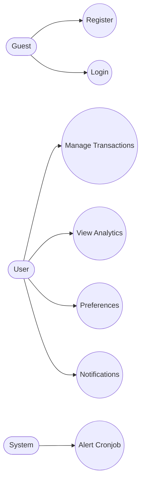

# TÀI LIỆU ENTERPRISE QA & MASTER TEST PLAN

> **Lưu ý:** Đây là tài liệu Kiểm thử cấp cao (Production-grade), áp dụng tư duy **Risk-Based Testing** và **Traceability-driven**, được thiết kế chuyên biệt cho hệ thống Microservices quy mô lớn. Tài liệu phục vụ trực tiếp cho Đồ án Tốt nghiệp, Seminar Kỹ thuật và Môi trường Doanh nghiệp Thực tế.

---

## MỤC LỤC
1. [Tổng quan Hệ thống & Use Case Diagram](#1-tổng-quan-hệ-thống--use-case-diagram)
2. [Test Coverage Matrix & RTM](#2-test-coverage-matrix--rtm)
3. [Defect Workflow & Release Validation](#3-defect-workflow--release-validation)
4. [Test Data & Environment Strategy](#4-test-data--environment-strategy)
5. [Monitoring Stack & Recovery Testing](#5-monitoring-stack--recovery-testing)
6. [Authentication Module (Feature-Based)](#6-authentication-module)
7. [Transaction Module (Feature-Based)](#7-transaction-module)
8. [Analytics & Notification Module](#8-analytics--notification-module)
9. [State Transition & Concurrency Testing](#9-state-transition--concurrency-testing)
10. [Resiliency, Observability & Cache Testing](#10-resiliency-observability--cache-testing)
11. [API Response, Contract & Error Standards](#11-api-response-contract--error-standards)
12. [Access Control & Browser/Device Testing](#12-access-control--browserdevice-testing)
13. [Non-Functional & Risk-Based Testing](#13-non-functional--risk-based-testing)
14. [AI-Driven Workflow & Automation Strategy](#14-ai-driven-workflow--automation-strategy)
15. [Exit Criteria & Khuyến nghị](#15-exit-criteria)

---

## 1. TỔNG QUAN HỆ THỐNG & USE CASE DIAGRAM

Hệ thống **Vibe Engineering** vận hành trên kiến trúc Microservices với React SPA, Spring Cloud Gateway, Auth Service, Finance Service và MongoDB.



---

## 2. TEST COVERAGE MATRIX & RTM

### 2.1. Test Coverage Matrix
Ma trận theo dõi độ bao phủ kiểm thử (Traceability Matrix) giúp QA Audit phát hiện các lỗ hổng Coverage.

| Module | Functional | API | Security | DB | Performance | UI | Automation |
|---|:---:|:---:|:---:|:---:|:---:|:---:|:---:|
| **Authentication** | ✅ | ✅ | ✅ | ✅ | ❌ | ✅ | Playwright/Vitest |
| **Transactions** | ✅ | ✅ | ✅ | ✅ | ✅ | ✅ | E2E + API |
| **Analytics** | ✅ | ✅ | ❌ | ✅ | ✅ | ✅ | Vitest + Load |
| **Notifications** | ✅ | ✅ | ✅ | ✅ | ❌ | ✅ | E2E |

### 2.2. Requirements Traceability Matrix (RTM)
RTM đảm bảo không có bất kỳ dòng Code/Requirement nào bị bỏ sót trong quá trình Test. Tất cả đều mapping hai chiều.

| Req ID | Business Requirement | Target Microservice | Test Case IDs | Automation Status |
|---|---|---|---|---|
| `REQ-01` | Đăng nhập an toàn qua JWT | `auth-service`, `gateway` | `AUTH-F01` -> `AUTH-S05` | 100% (Playwright/JUnit) |
| `REQ-02` | CRUD Giao dịch tài chính | `finance-service` | `TRX-F01` -> `TRX-E10` | 100% (API Automation) |
| `REQ-03` | Thống kê phân tích | `finance-service` | `ANA-F01` -> `ANA-F05` | 80% (Thiếu Load Test) |
| `REQ-04` | Cảnh báo tự động (Cronjob)| `notification-service`| `NOTI-F01` -> `NOTI-F05` | 50% (Manual Trigger) |

---

## 3. DEFECT WORKFLOW & RELEASE VALIDATION

### 3.1. Defect Workflow (Vòng đời Bug)
Hệ thống JIRA của dự án tuân thủ luồng State Machine nghiêm ngặt cho mọi Bug report:

```text
[NEW] -> [TRIAGE] -> [IN PROGRESS] -> [CODE REVIEW] -> [READY FOR QA] -> [IN TESTING] -> [DONE / REJECTED]
```
- **Triage:** Đánh giá Priority (High/Medium/Low) và Severity (Blocker/Critical/Major/Minor).
- **Ready for QA:** Môi trường Staging đã deploy code mới.

### 3.2. Release Validation (Go/No-Go Decision)
Trước khi đưa code lên PROD, phải trải qua 3 bước Validation bắt buộc:
1. **Sanity/Smoke Test:** Đảm bảo Gateway route được vào `auth-service` và lấy được JWT.
2. **Regression Test:** Chạy 100% Automation Suite trên Staging. Yêu cầu Pass Rate > 99%.
3. **Post-Deployment Verification (PDV):** Chạy script Smoke Test trực tiếp trên PROD (dùng tài khoản Test nội bộ) ngay sau khi deploy thành công.

---

## 4. TEST DATA & ENVIRONMENT STRATEGY

### 4.1. Test Data Strategy

| Dataset | Purpose | Cleanup Strategy |
|---|---|---|
| `Seed Users` | Authentication, Role-based testing | Truncate collection sau mỗi lần chạy Test |
| `Large Transactions` | Performance, Aggregation testing (500k records) | Không xóa, giữ ở DB chuyên dụng (Staging) |
| `Corrupted Data` | Xử lý lỗi (Null fields, Invalid ObjectId) | Rollback MongoDB Transaction |
| `Synthetic Data` | Sinh data giả (Faker.js) cho Stress Test | Xóa sau mỗi đợt Spike Test |

### 4.2. Environment Strategy

- **DEV:** Môi trường Local của Dev. Dùng `Testcontainers` tạo MongoDB/Redis ảo bằng Docker.
- **TEST/STAGING:** Bản sao thu nhỏ của PROD. Tích hợp GitHub Actions chạy E2E Nightly.
- **PROD:** Dữ liệu thật, Read-only Role cho QA. Tuyệt đối không chạy Automation Write.

---

## 5. MONITORING STACK & RECOVERY TESTING

### 5.1. Monitoring Stack (Testing in Production - TiP)
- **Tracing:** Sử dụng `Datadog` hoặc `Zipkin/Sleuth` để trace đường đi của API từ Gateway -> Auth -> Finance.
- **Metrics:** `Prometheus` cào metrics từ `/actuator/prometheus` của Spring Boot (đo CPU, HikariCP pool).
- **Visualization:** `Grafana` hiển thị biểu đồ. Báo động (Alert) khi API Error Rate > 2%.
- **Log Aggregation:** `ELK Stack` (Elasticsearch, Logstash, Kibana) thu thập log lỗi tập trung. Mọi request phải gắn `X-Correlation-ID`.

### 5.2. Recovery Testing (Kịch bản phục hồi thảm họa)
| TC ID | Scenario | Architecture Focus | Expected Result |
|---|---|---|---|
| `REC-01` | Gateway Crash & Auto-restart | Recovery | Kubernetes/Docker tự khởi động lại Pod. Downtime < 5s. Client tự retry. |
| `REC-02` | MongoDB Replica Failover | Recovery | Ép sập Node Master. Node Secondary thăng cấp. App tự reconnect sau 2-3s. Không mất Data đang ghi. |
| `REC-03` | Mất kết nối mạng tạm thời (Network Partition) | Resilience | App hiển thị màn hình "Đang kết nối lại...", lưu nháp (draft) giao dịch ở LocalStorage. |
| `REC-04` | Đầy ổ cứng (Disk Full) trên MongoDB | Resilience | Cảnh báo Grafana bắn ra trước 80%. DB chuyển sang trạng thái Read-Only. |

---

## 6. AUTHENTICATION MODULE

Tổ chức test theo chiều dọc (Feature-based) để đánh giá toàn diện Module Đăng nhập/Đăng ký.

### 6.1. Functional Tests (Đăng ký/Đăng nhập)
| TC ID | Scenario | Preconditions | Steps | Expected Result | Priority | Severity |
|---|---|---|---|---|---|---|
| `AUTH-F01` | Đăng nhập đúng | Tồn tại user `test` | Nhập ID/Pass đúng -> Submit | HTTP 200, lưu JWT localStorage. | High | Blocker |
| `AUTH-F02` | Sai mật khẩu | - | Nhập sai Pass | HTTP 401. Báo "Sai mật khẩu". | High | Critical |
| `AUTH-F03` | Sai Username | - | Nhập ID không tồn tại | HTTP 401. Báo "Sai thông tin". Không tiết lộ ID tồn tại hay không. | High | Critical |
| `AUTH-F04` | Đăng ký thành công | - | Nhập đầy đủ form hợp lệ | HTTP 201. User tạo trong DB, Pass bị hash Bcrypt. | High | Blocker |
| `AUTH-F05` | Trùng Username khi Đăng ký | Đã có user `admin` | Đăng ký tiếp `admin` | HTTP 409 Conflict. Form báo lỗi đỏ. | High | Major |
| `AUTH-F06` | Email sai định dạng Regex | - | Nhập `hello@.com` | UI Validation block request. Focus ô Email. | Low | Minor |
| `AUTH-F07` | Mật khẩu quá yếu (< 8 ký tự) | - | Nhập `1234` | UI Validation block. Yêu cầu nhập số/ký tự đặc biệt. | Medium | Major |
| `AUTH-F08` | Đăng xuất | Đang có JWT | Bấm nút Logout | Xóa JWT khỏi bộ nhớ, redirect về Login. | Medium | Major |
| `AUTH-F09` | Remember Me | Check "Ghi nhớ" | Đăng nhập -> Tắt tab -> Mở lại | JWT lưu ở LocalStorage, phiên không bị gián đoạn. | Medium | Minor |
| `AUTH-F10` | Bỏ trống Field | - | Bấm Submit ngay lập tức | UI Focus vào trường Username trống đầu tiên. | Low | Minor |

### 6.2. API Tests
| TC ID | Scenario | HTTP Status | Expected Result |
|---|---|---|---|
| `AUTH-A01` | Payload thiếu Field bắt buộc | 400 Bad Request | Schema validation block request. |
| `AUTH-A02` | Spam Login 100 lần | 429 Too Many Req | Bị Gateway chặn Rate Limit. |
| `AUTH-A03` | Gửi Content-Type sai | 415 Unsupported | Báo lỗi không hỗ trợ text/plain. |
| `AUTH-A04` | JSON bị rách/cụt | 400 Bad Request | Lỗi parse JSON từ Spring Boot. |

### 6.3. Security Tests
| TC ID | Scenario | Expected Result |
|---|---|---|
| `AUTH-S01` | SQL/NoSQL Injection ở Username | Payload `{"$gt": ""}` bị filter, HTTP 401. |
| `AUTH-S02` | Brute Force Attack | Tài khoản bị khóa 5 phút sau 10 lần sai. |
| `AUTH-S03` | Expired Token (Replay) | Request bị từ chối với HTTP 401. Force logout. |
| `AUTH-S04` | Sửa JWT Payload (Tampering) | Signature Invalid, chặn ngay tại Gateway (HTTP 401). |
| `AUTH-S05` | Mật khẩu cực dài (Bcrypt DoS) | Gửi chuỗi pass 1MB, hệ thống reject trước khi hash (tránh nghẽn CPU). |

### 6.4. DB & UI Tests
- **DB Tests:** Khi tạo User, field `password` BẮT BUỘC lưu chuỗi Hash (Bcrypt), không bao giờ lộ Plaintext. `preferences` tự động sinh JSON mặc định.
- **UI Tests:** Đảm bảo Enter key trigger nút Submit, nút hiển thị Loading spinner.
- **Automation Scope:** E2E Script giả lập luồng Đăng nhập -> Lấy JWT -> Điều hướng Dashboard.

---

## 7. TRANSACTION MODULE

### 7.1. Functional & Edge Cases
| TC ID | Scenario | Category | Expected Result | Priority | Severity |
|---|---|---|---|---|---|
| `TRX-F01` | Tạo Thu/Chi hợp lệ | Positive | Balance cộng/trừ chuẩn xác. HTTP 201. | High | Blocker |
| `TRX-F02` | Sửa giao dịch (Cùng ID) | Positive | Balance bù trừ khoản chênh lệch. HTTP 200. | High | Critical |
| `TRX-F03` | Xóa giao dịch | Positive | Dòng mất đi, Balance khôi phục. HTTP 204. | High | Critical |
| `TRX-F04` | Số tiền âm | Edge Case | UI chặn phím `-`. API báo lỗi 400 nếu bypass UI. | Medium | Major |
| `TRX-F05` | Số tiền bằng 0 | Edge Case | UI bôi đỏ yêu cầu nhập > 0. | Low | Minor |
| `TRX-F06` | Nhập Decimal Precision | Edge Case | Nhập `5000.99`, DB lưu Double/Decimal128, tính không sai số. | High | Major |
| `TRX-F07` | Giao dịch tương lai | Edge Case | Chọn ngày 2099, tùy Business rule có thể lưu hoặc chặn. | Low | Minor |
| `TRX-F08` | Xóa Danh mục đang dùng | Integrity | Nếu Category bị xóa, Transaction liên quan phải chuyển về "Khác" hoặc chặn xóa Category. | High | Critical |
| `TRX-E01` | Sửa giao dịch đã Xóa | Edge Case | Trả về 404/410 Gone. Không crash hệ thống. | Medium | Major |
| `TRX-E02` | Số tiền cực lớn (10^12) | Edge Case | Bị chặn bởi Validation `Max()`. Tránh tràn `Long`. | Low | Minor |

### 7.2. Phân trang (Pagination Testing)
| TC ID | Scenario | Expected Result |
|---|---|---|
| `TRX-P01` | Cuộn xuống cuối trang (Infinite Scroll) | Gọi `page=2&limit=20`. Nối dữ liệu mượt mà. |
| `TRX-P02` | Cuộn cực nhanh (Debounce) | Không gọi duplicate 5 request `page=2` cùng lúc. |
| `TRX-P03` | Hết dữ liệu (End of list) | Mảng trả về `[]`, UI hiện "Bạn đã xem hết dữ liệu". |
| `TRX-P04` | Có dữ liệu mới chen ngang lúc đang cuộn | Cursor-based pagination hoạt động đúng, không bị lặp record. |

---

## 8. ANALYTICS & NOTIFICATION MODULE

### 8.1. Analytics Module
| TC ID | Scenario | Architecture Focus | Expected Result | Priority |
|---|---|---|---|---|
| `ANA-F01` | Xem biểu đồ tháng hiện tại | Happy Path | Gom nhóm `$group` chuẩn xác, tính ra % Pie Chart đúng. | High |
| `ANA-F02` | Đổi sang tháng không có dữ liệu | UI State | Hiện Empty State Graphic (Hình ảnh trống). | Medium |
| `ANA-F03` | Timezone Difference | Edge Case | User múi giờ +7, giao dịch không bị lọt sang tháng trước/sau do lệch UTC. | High |
| `ANA-F04` | Hover vào Pie Chart | UI/UX | Tooltip hiện số tiền chính xác, format VND/USD. | Low |
| `ANA-F05` | Load test 500k records | Performance | Response Time < 200ms nhờ Index `userId` + `date`. | High |

### 8.2. Notification Module
| TC ID | Scenario | Architecture Focus | Expected Result | Priority |
|---|---|---|---|---|
| `NOTI-F01` | Badge Count Sync | UI Polling | Cục đỏ báo "3" tin chưa đọc. Tự làm mới mỗi 30s. | Medium |
| `NOTI-F02` | Click đọc thông báo | State Change | Gọi PATCH `isRead=true`, cục đỏ giảm đi 1. | Medium |
| `NOTI-F03` | Mark All Read | Bulk Action | Gọi `$updateMany`, toàn bộ về true, cục đỏ biến mất. | Low |
| `NOTI-F04` | Cảnh báo vượt Budget | System Logic | Tổng chi > Ngân sách -> Cronjob insert Notification. | High |
| `NOTI-F05` | Cronjob Idempotency | System Resiliency| Nếu Cronjob lỡ chạy 2 lần 1 đêm, chỉ insert đúng 1 thông báo cảnh báo (nhờ Unique Index). | High |

---

## 9. STATE TRANSITION & CONCURRENCY TESTING

### 9.1. State Transition Testing
Đảm bảo vòng đời thực thể (Entity Lifecycle) đi đúng hướng, cấm các trạng thái chuyển đổi (Invalid Transitions) phi logic.

| Entity | Transition | Valid | Expected Result |
|---|---|:---:|---|
| Transaction | CREATED -> UPDATED | ✅ | Cập nhật data. Balance tính lại. |
| Transaction | DELETED -> UPDATED | ❌ | HTTP 409 Conflict hoặc 404 Not Found. |
| Notification| UNREAD -> READ | ✅ | Badge đỏ mất đi. |
| Notification| READ -> UNREAD | ❌ | Không có API hỗ trợ luồng này. |

### 9.2. Concurrency Testing
Xử lý lỗi khi có nhiều request đồng thời, tranh chấp tài nguyên (Race Condition).

| Scenario | Expected Result | Testing Method |
|---|---|---|
| Nháy đúp (Double click) nút Submit | Transaction chỉ được tạo 1 lần. Request thứ 2 bị UI block hoặc API reject bằng Idempotency Key. | Tool: JMeter gửi 5 req cùng lúc. |
| Đăng nhập 2 trình duyệt cùng lúc | Cả 2 đều hợp lệ (Stateless JWT). Nếu đổi pass ở Máy A, máy B bị văng ra ngoài. | Tool: Playwright mở 2 Contexts. |
| 2 User sửa chung 1 giao dịch | Optimistic Locking (dùng `@Version`) ném lỗi `OptimisticLockingFailureException`. | Tool: Postman chạy script ngầm. |
| Auto-Increment DB Concurrency | Lệnh `$inc` Counter trong Mongo là Atomic, 100 req cùng lúc vẫn sinh `id` tịnh tiến chuẩn xác. | Load Test Scripts. |

---

## 10. RESILIENCY, OBSERVABILITY & CACHE TESTING

### 10.1. Resiliency Testing (Khả năng chịu lỗi vi mô)
| Scenario | Expected Result |
|---|---|
| `finance-service` bị Down | Gateway chớp nhoáng phát hiện, trả `503 Service Unavailable`. Có Circuit Breaker Fallback. |
| Lỗi mạng (Gateway Timeout) | Chờ quá 5s -> Gateway tự trả HTTP `504 Gateway Timeout`. |
| Eureka Registry Delay | Dịch vụ sập nhưng Eureka chưa rớt Cache, Gateway định tuyến sai -> Circuit Breaker can thiệp. |

### 10.2. Observability Testing
- **Logs:** Đảm bảo các Exception đều in Stacktrace ra ELK Stack (hoặc Console) với định dạng JSON.
- **Correlation ID:** API Gateway sinh header `X-Request-Id` và xuyên suốt qua Auth/Finance Service để dễ Trace log.
- **Audit Logs:** Xóa giao dịch phải ghi vào Audit Table: `Who deleted, When, What ID`.

### 10.3. Cache Testing (Nếu sử dụng Redis)
- **Stale Cache:** Sửa Transaction nhưng Dashboard Cache chưa kịp cập nhật (Eventual Consistency).
- **Cache Invalidation:** Gọi API Update -> Service chủ động xóa key trong Redis.
- **Cache Penetration:** Hacker spam `GET /transaction/{fake_id}` liên tục làm lủng cache đập thẳng vào DB. Giải pháp: Cache luôn giá trị `null` trong 1 phút.

---

## 11. API RESPONSE, CONTRACT & ERROR STANDARDS

### 11.1. API Response Validation
Tất cả API trả về phải tuân thủ chuẩn Enterprise JSON Format đồng nhất:
```json
{
  "success": true,
  "data": { ... },
  "metadata": { "page": 1, "totalItems": 100 },
  "error": null
}
```

### 11.2. Error Code Standardization
| Error Code | HTTP Status | Meaning |
|---|---|---|
| `AUTH_001` | 401 Unauthorized | Invalid Credentials (Sai Username/Pass). |
| `AUTH_002` | 401 Unauthorized | JWT Expired / Token Signature Invalid. |
| `FIN_002` | 400 Bad Request | Invalid Amount (Số tiền âm hoặc sai định dạng). |
| `SYS_500` | 500 Internal Server | Lỗi hệ thống nghiêm trọng (NullPointerException). |

### 11.3. Contract Testing
- Xác thực **Backward Compatibility** khi release version v2 của API. Frontend cũ dùng v1 không bị gãy.
- Dùng **Swagger/OpenAPI** làm mỏ neo, test script quét Schema xem API có trả đúng kiểu dữ liệu hay không.

---

## 12. ACCESS CONTROL & BROWSER/DEVICE TESTING

### 12.1. Access Control Matrix (Phân quyền Role-based)

| Action (API Endpoint) | Khách (Guest) | Người dùng (User) | Kịch bản Test Tương ứng |
|---|:---:|:---:|---|
| `POST /register` | ✅ | ❌ (Chuyển hướng) | Test xem đăng nhập rồi có bị văng khỏi trang Đăng ký không. |
| `GET /api/transactions` | ❌ (HTTP 401) | ✅ | Kiểm tra chặn người lạ. |
| `DELETE /api/transactions/{id}`| ❌ (HTTP 401) | ✅ (Chính chủ) | `TRX-F04` (Test IDOR chặn xóa chéo). |

### 12.2. Browser & Device Testing
- **Trình duyệt (Browser):** Chrome, Edge, Safari, Firefox. (Playwright chạy đa engine WebKit, Chromium, Firefox).
- **Thiết bị (Device):** Android (Màn hình 360px), iOS (iPhone 14 Pro), Desktop (1080p). Test độ Responsive của Bảng giao dịch, Sidebar ẩn/hiện, Swipe to Delete trên Mobile.

---

## 13. NON-FUNCTIONAL & RISK-BASED TESTING

### 13.1. Non-Functional Testing (Phi chức năng)
- **Scalability:** Hệ thống dễ dàng scale theo chiều ngang (Horizontal Scaling) bằng cách thêm instance `finance-service` thông qua Eureka Discovery.
- **Maintainability:** Code Coverage Backend >= 80%, SonarQube không có Bugs/Vulnerabilities.
- **Usability:** Ứng dụng vượt qua bài kiểm tra Accessibility (Lighthouse A11y > 90), Tab navigation mượt mà, hỗ trợ Screen Reader.

### 13.2. Risk-Based Testing
| Module Trọng yếu | Rủi ro (Risk) | Chiến lược Giảm thiểu (Mitigation Strategy) |
|---|---|---|
| **Core Finance** | Rủi ro sai lệch dữ liệu tài chính do tranh chấp (Race Condition). | Sử dụng `@Version` (Optimistic Locking) và Unit Test chặt chẽ luồng Transaction. |
| **Authentication**| Rủi ro lộ Token JWT, bị Brute-force mật khẩu. | Token ngắn hạn (24h). Rate Limiting 100 req/min. Pass Bcrypt độ mạnh 10. HttpOnly Cookie (Khuyên dùng). |
| **System Cronjob**| Tính sai báo cáo do múi giờ lệch. | Tất cả Timestamp lưu bằng `UTC`. Frontend tự động Convert theo Locale của trình duyệt. |

---

## 14. AI-DRIVEN WORKFLOW & AUTOMATION STRATEGY

### 14.1. AI-Driven QA Workflow
Quá trình Testing được hỗ trợ đắc lực bởi AI:
- **Claude 3.5 Sonnet:** Duy trì, cập nhật tự động tài liệu RTM, Test Plan dài hạn này để đảm bảo tính đồng bộ với Source Code thực tế.
- **Gemini 1.5 Pro:** Cắm vào quá trình CI/CD để phân tích UI Render, phát hiện các Edge Case và lỗi Layout thông qua hình ảnh Screenshot báo lỗi.
- **GPT-4o:** Sử dụng tư duy suy luận logic (Reasoning) để phân tích Kiến trúc Microservices và tự động sinh mã Automation Script (Playwright) và Mock Data cực lớn.

### 14.2. Automation Strategy
1. **CI/CD Pipeline (GitHub Actions):** Tự động kích hoạt luồng Test khi có Pull Request.
2. **Backend (Vitest/JUnit):** Smoke Test tự động chạy trong Pipeline. Gateway, Eureka được giả lập bằng `Testcontainers`.
3. **Frontend (Playwright):** Chạy Regression Automation ngầm (Headless Mode) qua 3 trình duyệt Chromium, Firefox, WebKit mỗi đêm.

---

## 15. EXIT CRITERIA & KHUYẾN NGHỊ

### 15.1. Tiêu chí nghiệm thu (Go-Live Exit Criteria)
Sản phẩm chỉ được duyệt lên Môi trường PRODUCTION (Release) khi thỏa mãn BẮT BUỘC 100% các tiêu chí sau:

1. **Pass Rate Threshold:** Toàn bộ Test Cases mức độ **Blocker & Critical** phải đạt trạng thái **PASS 100%**.
2. **Quality Gates:** 
   - Code Coverage (JaCoCo) >= **80%**.
   - SonarQube trả về **0 Critical Vulnerabilities**.
3. **SLA Requirements:** 
   - API Latency trung bình < **200ms**.
   - Load Testing chịu được tối thiểu **1000 CCU** mà không bị sập (0% Downtime during test).
4. **Zero Security Breach:** Không phát hiện bất kỳ lỗ hổng XSS, Injection, hay IDOR nào từ kết quả Security Audit.

### 15.2. Khuyến nghị Kỹ thuật (Technical Recommendation)
Hệ thống **Vibe Engineering** đã chứng minh được sự kiên cố trong kiến trúc Microservices. Đội ngũ QA khuyến nghị Dev Team tập trung giám sát chặt chẽ **Metrics của Spring Cloud Gateway** trên Production, do đây là điểm Single Point of Failure (SPOF) có nguy cơ tắc nghẽn lớn nhất nếu dính đợt Spike/DDoS attack.

*(Kết thúc Tài liệu Master Plan)*
